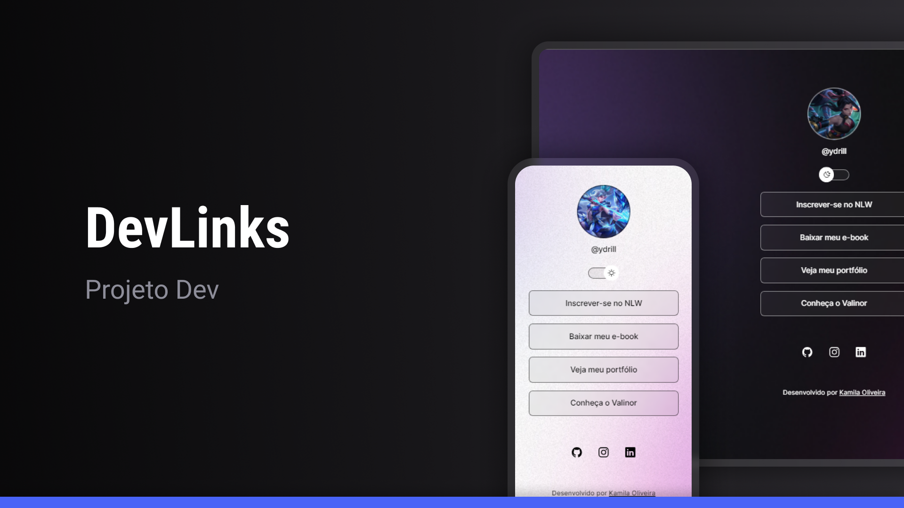

<h1 align="center"> DevLinks </h1>

 

  

## 🚀 Tecnologias

Esse projeto foi desenvolvido com as seguintes tecnologias:

- HTML e CSS
- JavaScript
- Git e Github
- Figma

## 💻 Projeto

O DevLinks é um agregador de links para usar como cartão de visitas online

## 🔖 Site

Você pode visualizar o site através [DESSE LINK](https://kamilaoliveira0108.github.io/devlinks/)

Feito com ♥ by Kamila Oliveira
